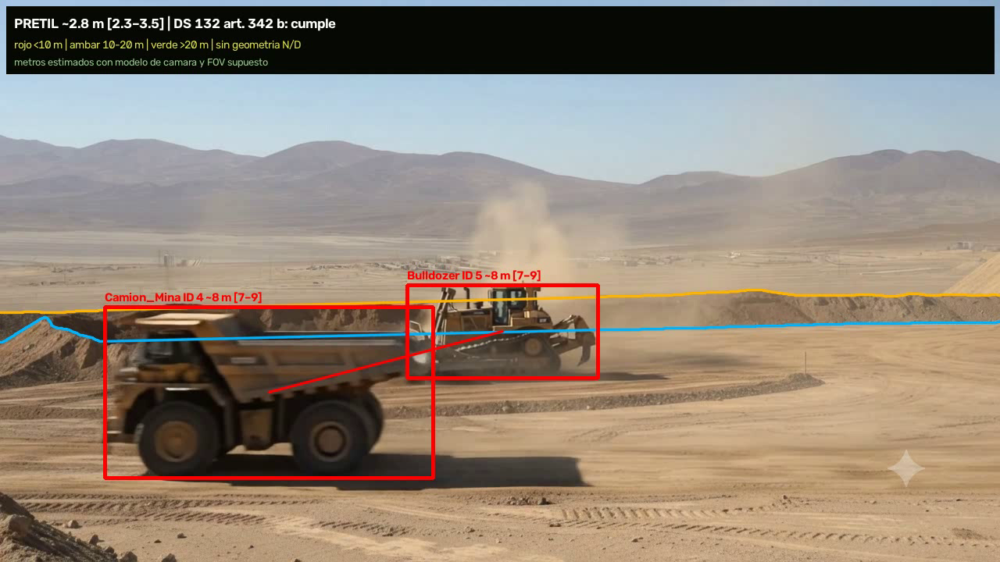
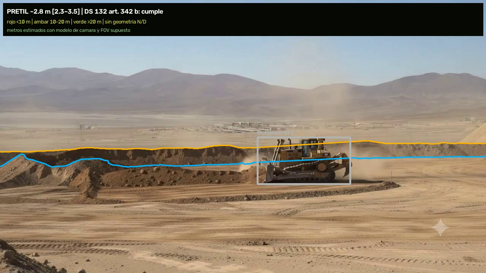
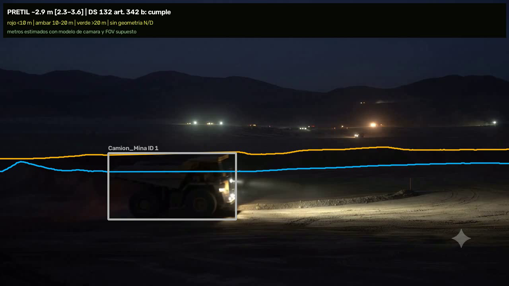
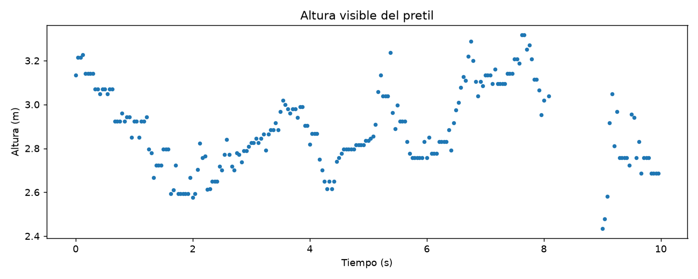
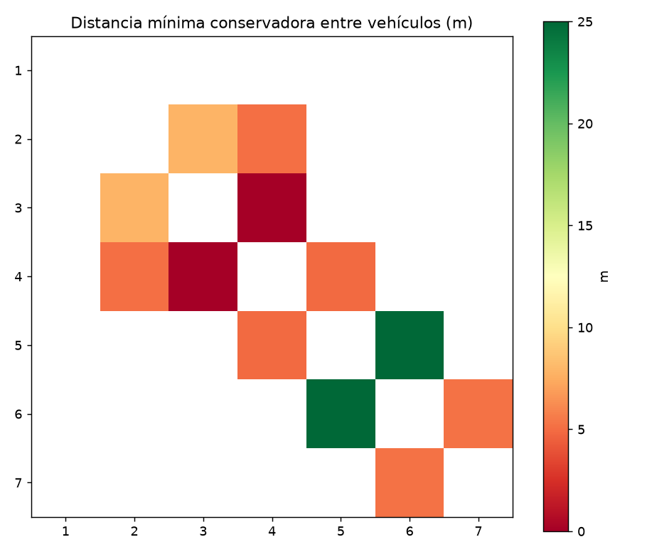
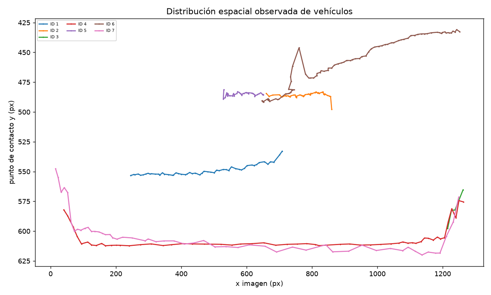

# 🏗️ Machinery Vision Tracker — Computer vision for mining machinery and safety berms

**Built in six days · Two computer vision methods · From design to integrated delivery**

A computer vision pipeline for monitoring mining machinery and estimating safety berm height. This presentation highlights **Method 2**, with screenshots of its outputs on AI-generated synthetic video.



*Video 02, second 5, from the run using approved berm masks. Overlay measurements and verdicts are assumption-based estimates, not survey measurements or safety certification. Original screenshots and plots retain their Spanish labels.*

---

## ✨ Features

- Detects machinery using YOLO11n-seg fine-tuned on custom annotations.
- Associates detections across frames through tracking with global assignment.
- Delineates the berm using approved masks and temporal propagation.
- Estimates height and proximity using camera geometry, dimensional references, and intervals.
- Reports insufficient evidence as N/D (not available), rather than treating it as a safe condition.
- Produces annotated video, CSV series, plots, and run metadata.

## 🎬 Method 2 in action

| Machinery and berm — second 3 | Night scene — second 1 |
|---|---|
|  |  |

Screenshots from the same video, with the original overlays unchanged. The night scene comes from a run using approved external masks: it does not demonstrate automatic berm recognition in darkness.

## 🖼️ Overlay breakdown

### What the camera identifies

| Element | Meaning |
|---|---|
| Bounding box and class | Machinery detection |
| ID | Tracker-assigned identity, not a manually verified identity |
| Orange and blue lines | Berm boundaries in the run using approved masks |

### What the geometry estimates

| Element | Meaning |
|---|---|
| Height and interval | Estimated berm height and stated uncertainty |
| Line between vehicles | Estimated proximity for that pair |
| Red / amber / green | Exercise thresholds: below 10 m / up to 20 m / above 20 m |
| Gray / N/D | Insufficient evidence or geometry; does not imply safety |

### What is recorded

| Artifact | What it supports |
|---|---|
| Height series | Inspection of estimate variation during the clip |
| Distance matrix | Lowest available conservative distance per ID pair |
| Spatial distribution | Observed trajectories in image coordinates |

## ⚙️ How it works

```text
Video → Fine-tuned YOLO11n-seg → vehicles → tracking → scene-specific geometry
                                                                  ↓
Approved seed → SAM 2.1 / propagation → berm → fusion and diagnostics
                                                                  ↓
                                      Annotated video · CSV · plots · metadata
```

| Component | Role |
|---|---|
| YOLO11n-seg | Specialized detector fine-tuned on custom annotations |
| SAM 2.1 Hiera Small | Promptable segmentation and temporal propagation; requires a seed |
| Tracking | Hungarian assignment, motion, and lifecycle handling for missing detections |
| Geometry | Dimensional references, intervals, and scene-specific validity gates |
| Diagnostics | Separates observations, estimates, and missing evidence |
| Validation | Fixtures, visual review, contracts, offline Docker checks, and hashes |

An independent Method 1 was also implemented: photometric berm extraction with daylight memory and Grounding DINO Tiny for vehicles.

## 📐 From pixels to meters: berm height

Method 2 does not convert every pixel using a single fixed global scale. The final report and height module document the following procedure:

1. **Delineate the berm:** start from an approved mask and its temporal propagation. Each valid column provides the upper boundary (crest) and lower boundary (base).
2. **Measure visible thickness:** `base_row − crest_row + 1`, in pixels. Columns occluded by machinery are excluded when a dynamic mask is supplied; the median thickness and base row are used.
3. **Fit the camera per scene:** use apparent machinery size and declared class dimensions. The report uses a truck reference of 6.6 × 13.7 × 8.29 m and a bulldozer reference of 4.5 × 10.9 × 6.7 m, with uncertainties of 12% and 15%, respectively. These are class references, not measured dimensions of each synthetic vehicle.
4. **Convert to meters:** apply the estimated horizon and camera height for that segment:

```text
berm_height_m = thickness_px × camera_height_m / (base_row_px − horizon_px)
```

The assumed FOV cancels out in this height expression; it does affect distances between vehicles. In the masked run for video 02, metadata records a horizon of **274.49 px** and an estimated camera height of **10.63 m**. These are not field-surveyed parameters.

5. **Report uncertainty and status:** calculate bounds using horizon limits and camera-height uncertainty. Validity gates reject insufficient support, area or thickness jumps, and invalid geometry instead of displaying a misleading measurement.

### Example from the displayed run

The first CSV row records **42 px** of thickness and **3.134 m**, with an interval of **2.489–3.876 m**. At the end, row 239 records **37 px** and **2.685 m**, with an interval of **2.137–3.315 m**. These are per-frame estimates, not verified physical changes in the berm.

The code compares the interval with an exercise threshold based on a 3.596 m reference wheel: **1.798 m** for the half-wheel criterion or **2.397 m** for two-thirds. It returns `cumple` (meets threshold) when the lower bound exceeds the threshold, `por_debajo` (below threshold) when the upper bound is below it, and `no_concluyente` (inconclusive) when the interval crosses it. The selected criterion is a project assumption; the overlay does not certify legal compliance in the field.

**Do not mix runs:** the 3.60 m estimate and 2.74–4.23 m interval for video 02 in benchmark section 5.4 belong to the sprint 18 run, not this integrated masked output. The examples above come from the CSV accompanying these images.

## 📈 Video 02 plots

These are original files from the same run using approved masks; they were neither recalculated nor retouched.

### Visible berm height over time



Each point represents an available height estimate at that instant, supporting inspection of variation and continuity during the clip. The plot shows nominal values, **not an uncertainty band**: bounds are stored in `berm_height_series.csv`. Visual variation does not establish a collapse or survey-level accuracy.

### Proximity and spatial distribution

| Conservative minimum distances | Observed image-space trajectories |
|---|---|
|  |  |

The **matrix** summarizes the lowest available conservative distance between ID pairs during the video. White cells do not indicate safety: they include the diagonal and pairs without a valid distance. It does not represent simultaneous distances between all vehicles.

The **spatial distribution** plots each track's observed contact point in image coordinates, **in pixels, not meters**. IDs identify algorithmic tracks; without annotated identities, they do not necessarily represent seven distinct machines.

## ⏱️ Built in six days

Between **September 6 and 11, 2026**, two approaches were developed: Method 1 with classical extraction and Grounding DINO Tiny, and Method 2 with YOLO11n-seg and SAM2. The work included assisted annotation, training, tracking, geometry, visualization, testing, and packaging. This presentation focuses on Method 2.

| Date | Documented milestones |
|---|---|
| September 6 | Scope definition, execution contracts, and initial classical pipeline across the four videos |
| September 7 | Initial approach comparison, Grounding DINO integration, and visual review identifying issues despite passing tests |
| September 8 | Daylight berm memory, evidence states, and verification of the extracted Method 1 package |
| September 9 | Method 1 refinement and Method 2 redesign with SAM2, YOLO-seg, and sprint-based development |
| September 10 | Assisted annotation with human review in Label Studio; Method 1 height and calibration improvements |
| September 11 | YOLO11n-seg training, Method 2 tracking and geometry integration, mask-evaluation correction, reporting, and delivery |

This timeline describes development of the technical exercise, not production validation. File reorganization and this portfolio presentation were completed later.

## 🛠️ Annotation and engineering decisions

As documented in the delivery materials:

- Designed the Method 2 architecture and organized development into sprints.
- Built and reviewed the assisted annotation workflow: SAM2 proposes; Label Studio supports accepting, correcting, or drawing masks.
- Distinguished human-drawn masks from approved proposals, requiring a correction to the night evaluation.
- Proposed machinery dimensions as geometric references.
- Rejected visually incorrect outputs even when unit tests passed.
- Integrated AI and MCP with human review, traceability, and artifact verification.

## 🚀 Installation and usage

Both methods' source code is available under **AGPL-3.0**. Full videos, weights,
and annotation databases are not included; use your own authorized material.

```bash
python -m venv .venv
# Activate the environment for your operating system.
python -m pip install -r requirements.txt
python main.py --help
```

### Method 2 — YOLO-seg and geometry

Requires a segmentation checkpoint compatible with the machinery classes:

```bash
python main.py --method 2 --input examples/videos --output outputs/method2 --weights models/yoloseg_maquinaria_train_v2.pt --device cpu
```

Create the input folder and place your clips there locally. For GPU execution,
use `--device 0` with a compatible PyTorch installation. External berm masks
are optional through `--berm-mask-root`; without them, the berm remains N/D.
The runner does not execute SAM2 automatically.

### Method 1 — Grounding DINO and classical berm extraction

The following script downloads the public detector and verifies its revision
and hash. Downloading requires network access and disk space for the weights:

```bash
python scripts/fetch_semantic_detector.py --destination models/grounding-dino-tiny
python main.py --method 1 --input examples/videos --output outputs/method1 --detector-model-dir models/grounding-dino-tiny
```

### Tests

```bash
python -m unittest discover -s tests
python scripts/validate_publication.py
```

Tests include fixtures generated at runtime and do not require the original
videos. The second command checks publication hygiene, not detector accuracy.
The Dockerfile supports building the environment; models are not included.

## 🧪 Training your own segmentation model

The machinery detector was fine-tuned using annotations approved in Label Studio. SAM2 helped generate mask proposals for human review; **SAM2 was not trained as an automatic berm detector**.

YOLO11n-seg was trained twice. Method 2 uses `train_v2`, initialized from the `best.pt` checkpoint of `train_v1`, rather than training from scratch.

This command expresses the main parameters recorded in `train_v2/args.yaml`, using example relative paths. It requires the previous checkpoint and your own segmentation dataset; it does not reproduce the entire original environment by itself.

```bash
yolo segment train model=weights/train_v1/best.pt data=dataset/dataset.yaml epochs=30 patience=10 imgsz=960 batch=4 seed=42 device=0 workers=2 optimizer=auto deterministic=True project=runs/segment name=train_v2
```

| Documented parameter | Value |
|---|---|
| Training / validation images | 70 / 16 |
| Classes (original labels) | Camion_Mina, Bulldozer, Cargador_Frontal, Excavadora, Otra_Maquinaria |
| Epochs / patience | 30 / 10 |
| Input size / batch | 960 px / 4 |
| Seed | 42 |
| Frozen backbone | No: `freeze: null` |
| Optimizer | Automatic |

Unlike the chess example, this project does not document a frozen backbone or an explicit reduced-learning-rate policy. Adapting the detector to another site requires a reviewed custom dataset and validation split by video or camera: the original experiment shares videos between training and validation and **does not demonstrate generalization**.

## 💡 Lessons learned

- **Passing tests is not enough:** outputs with passing tests were rejected during visual review. Code contracts and video inspection uncover different problems.
- **An approved proposal is not an independent label:** distinguishing hand-drawn masks from SAM2-generated ones prevented evaluation against the model's own predictions and required correcting the night evaluation.
- **Segmentation is not recognition:** SAM2 follows a prompt but does not automatically identify a berm in a new scene. Its seed dependency must be explicit.
- **Memory needs boundaries:** retaining a daylight reference can help at night, but transferring it after a scene change produces incorrect geometry. Its origin and validity must be tracked.
- **Meters require defensible assumptions:** dimensional references, perspective, and uncertainty matter more than a global pixel conversion. Without external calibration, the result remains an estimate.
- **N/D is a useful result:** when geometry fails, declaring uncertainty is preferable to showing green without supporting evidence.
- **Tracking quality is not an ID count:** more identifiers can indicate fragmentation rather than more vehicles. Annotated trajectories are needed to measure quality.
- **Small datasets can produce misleading metrics:** splitting frames from the same videos between training and validation does not demonstrate performance on another camera or site.
- **Synthetic material shapes the results:** clips compress time and contain fast occlusions, abrupt lighting changes, and trucks that morph, appear suddenly, or change appearance between frames. These discontinuities can break tracking without corresponding to real physical motion; they should not automatically be attributed to the detector or tracker.
- **AI accelerates; evidence decides:** assisted annotation, agents, and MCP helped build and review the system; final decisions were checked against code, images, tests, and provenance.

## ⚠️ Experimental limitations

Four synthetic videos, approximately 40 seconds and 1,022 frames. Of 42 approved berm masks, only 11 were hand-drawn. Model proposals are not automatically considered ground truth.

**Source conditions:** AI-generated videos with accelerated action and transitions, fast occlusions, and machinery *morphing*, including sudden appearances. The documented corpus has nominal rates of 24–30 FPS but few frames to describe such compressed changes; it is not equivalent to observing those movements at natural speed. Darkness and compression further reduce visual evidence. These results describe behavior on this material, not validation with real mining-site cameras.

- YOLO validation shares videos with training: it does not demonstrate generalization.
- There is no ground truth for identities or measured distances.
- SAM2 requires a seed; a new video without one leaves the berm as N/D.
- Night memory fails in some documented cases and has not been generally validated.
- Metric estimates depend on references and assumed FOV, without external calibration.
- Selected screenshots explain the outputs; they are neither a complete evaluation nor production evidence.

## 📚 Documentation

- [Publication plan](PUBLICATION_PLAN.md)
- [AI-assisted engineering](AI_ASSISTED_ENGINEERING.md)
- [Provenance map](docs/PROVENANCE_MAP.md)
- [Limitations and experimental transparency](docs/LIMITATIONS.md)
- [Pre-publication audit](docs/PRE_PUBLISH_AUDIT.md)

## 🙏 Built with

[Ultralytics YOLO11](https://github.com/ultralytics/ultralytics) · [SAM 2.1](https://github.com/facebookresearch/sam2) · [PyTorch](https://pytorch.org/) · [OpenCV](https://opencv.org/) · [SciPy](https://scipy.org/) (Hungarian assignment) · [NumPy](https://numpy.org/) · [Label Studio](https://labelstud.io/) · [Docker](https://www.docker.com/)
